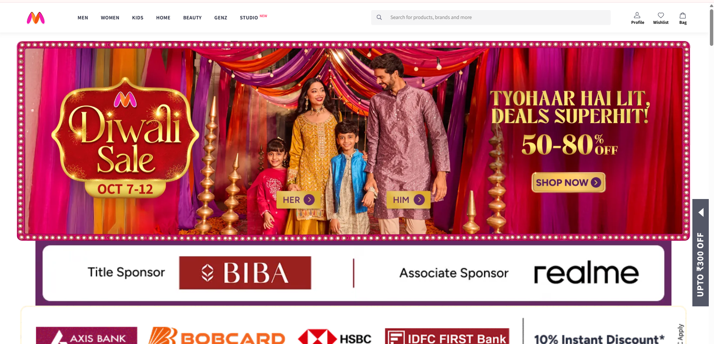

# **🛍️ Myntra Fashion Products EDA**

This project presents an Exploratory Data Analysis (EDA) of fashion product data scraped from Myntra, one of India’s largest e-commerce fashion platforms. The goal of this project is to uncover insights about pricing trends, brand performance, discount patterns, and customer preferences in the online fashion retail space.

## **📁 Dataset Overview**

- **Source:** [Myntra Sales Dataset](https://www.kaggle.com/datasets/skmewati/myntra-sales-dataset)
- **File Used:** `myntra_dataset_ByScraping.csv`
- **File Size:** ~3.37 MB
- **Total Rows:** 52,120
- **Total Columns:** 8
- **Source:** Data collected from Myntra using **Python**, **Selenium** and **BeautifulSoup**

### **🔹Features**

| Column Name        | Description |
|--------------------|-------------|
| **Product Name**   | Name of the product listed on Myntra |
| **Brand**          | Brand name of the product |
| **Price**          | Final selling price after discount |
| **MRP**            | Original price of the product |
| **Discount (%)**   | Discount percentage available |
| **Rating**         | Average product rating |
| **Number of Ratings** | Total ratings received |

## **🎯 Objectives**

- Explore pricing and discount trends across brands and product categories

- Analyze relationships between ratings, price, and discounts

- Identify top-performing brands based on customer ratings and popularity

- Visualize insights using Power BI dashboards

## 🛠Tools Used
These tools did the heavy lifting while I binged data like a good series:
- 🐍Python - My ride-or-die for all things data
- ⛅Google Colab - The cozy corner where all the magic happens
- 🐼Pandas - The Marie Kondo of tabular data
- 🔢Numpy - Crunching numbers faster than you can say "array"
- 📊Matplotlib - Where your data becomes visual poetry...and sometimes pie (still not edible)
- 🌊Seaborn - Matplotlib's artsy cousin who studied design in Paris